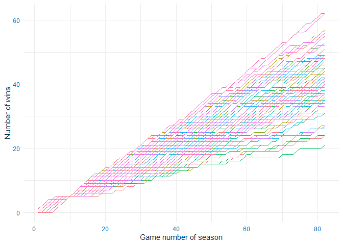

<!-- README.md is generated from README.Rmd. Please edit that file -->

# nbaWinLossExplorer

<!-- badges: start -->

<!-- badges: end -->

The `nbaWinLossExplorer` shiny app was created as part of STA 2453 to
demonstrate building shiny applications for productions. The application
itself is used to explore expected win/loss records for NBA teams.

The idea came from the weird and awful 2020-2021 Toronto Raptors season.
The raptors finished the season with 27 wins and 45 losses, but for most
of the season has a positive plus/minus (i.e. they scored more points
than their opponents). A natural question arises: how does a team with a
losing record but a positive plus/minus perform?

The application makes use of every game played in the NBA since 1947. A
user can select a number of wins and losse, as well as a plus/minus
differential (within a tolerance), and see the final season outcomes for
every team who matched those inputs.

For example, let’s look at one example. Let’s look at all teams that
started their season with 5 wins and 5 loses, with a plus minus between
-10 and + 10. We are going to make use of the data that loads with the
package (`nba_season_data`)

``` r
library(dplyr)
library(ggplot2)
library(nbastatR)
library(nbaWinLossExplorer)

 acceptable_records <- nba_season_data %>%
            mutate(contains_record = (wins == 5) &
                       (losses == 5) &
                       (plus_minus_post >= -10 ) &
                       (plus_minus_post <= 10)) %>%
            group_by(name_team, year_season) %>%
            arrange(date_game) %>%
            mutate(keep = max(contains_record)) %>%
            filter(keep > 0) %>%
            ungroup()
```

``` r
example_season_plot <- acceptable_records %>%
            ggplot(aes(number_game_team_season, wins, color = id)) +
            geom_line() +
            labs(x = "Game number of season",
                 y = "Number of wins")  +
            theme_minimal()+
            theme(legend.position='none') +
            theme(axis.text.x = element_text(colour = "#006bb8"),
                  axis.text.y = element_text(colour = "#006bb8"),
                  axis.title.x = element_text(colour = "#032f4f"),
                  axis.title.y = element_text(colour = "#032f4f"))

example_season_plotly <- plotly::ggplotly(example_season_plot)
example_season_plotly
```



We can see the lines cross where every team was 5-5. Now we can
calculate some sample statistics.

``` r

season_summary <- acceptable_records %>% 
  group_by(id) %>% 
  slice(1) %>% 
  ungroup()
  
# how many teams match the requirements
nrow(season_summary)
#> [1] 86

# what proportion make the playoffs
sum(season_summary$made_playoffs)/nrow(season_summary)
#> [1] 0.6395349

# distribution of wins and losses at the end of the season
summary(season_summary$final_wins)
#>    Min. 1st Qu.  Median    Mean 3rd Qu.    Max. 
#>   19.00   35.00   41.00   41.01   48.00   62.00
summary(season_summary$final_losses)
#>    Min. 1st Qu.  Median    Mean 3rd Qu.    Max. 
#>   19.00   32.25   38.00   38.21   44.75   61.00
```

We can see that 86 teams match these requirements, with 65.8% making the
playoffs. The median number of wins is 40 (IQR 34.5-48.0) and median
number of losses of 39 (33.0-45.0). So on average, teams finish with
roughly the same number of wins and losses.

For more detail see the package vignette.

## Installation

The development version from [GitHub](https://github.com/) with:

``` r
# install.packages("devtools")
devtools::install_github("murrayjw/nbaWinLossExplorer")
```

## To run the app

``` r
# install.packages("devtools")
nbaWinLossExplorer::run_app()
```
